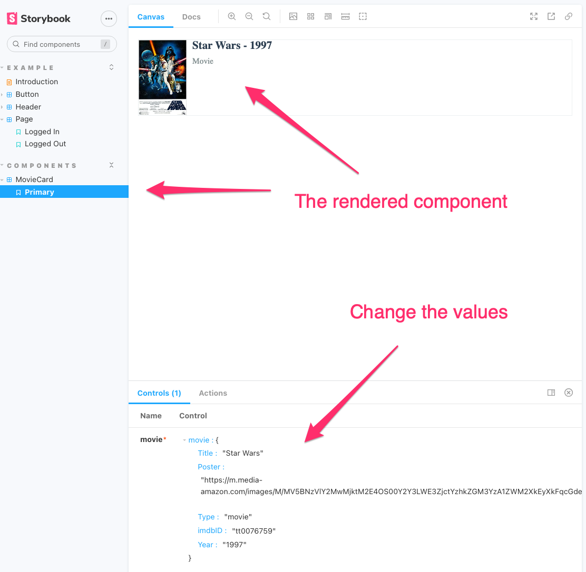

# Action Item: Frontend Scalability

In this Action Item we will scale the frontend application we have built previously.

**Make sure you set aside at least 2 hours of focused, uninterrupted work and give your best.**

In order to scale the frontend application we will:

1. Setup a `CDN` for the `S3` bucket where the application is deployed
2. Setup tooling for a design system with `Storybook`

## App Setup:
Install dependencies:
```bash 
npm install
```

Run in production mode:
```bash 
npm run production
```
### Step by Step
------
## 1. Setup a `CDN` for the `S3` bucket where the application is deployed

We will use the AWS service `Cloud Front` to scale our application to different locations across the globe.


1.1 Deploy a CloudFront distribution connected to your `S3` bucket
1.2 Run a `Lighthouse` diagnosis and compare both results

[Click here for a step-by-step video](https://codewithdragos.wistia.com/medias/9dtmkn3rpy)

CloudFront is connected to the `S3` bucket and will create replicas of our static assets, compress them and add the right caching strategy(http headers). 

Every time we update a file in `S3`, it will be updated in all the edge locations also. Users will be redirected to the edge location closes to them, which reduces `latency` and `time-to-first-bite`.


----

## 2. Setup tooling for a design system with `Storybook`

2.1 Add `Storybook`:
```bash
npx sb init
```

There is a [known issue](https://github.com/storybookjs/storybook/issues/14497) with `Storybook` and `Webpack`. To solve it you need to:
```bash
npm install dotenv-webpack@6.0.4 --save-dev
```

Once the installation finshed, run:

```bash
npm run storybook
```

And after is finished you should see this in your browser:


2.2 Add a `story`:

A story is a way to display a component with some state.

To add one for our `MovieCard` component create a new file:

```bash
touch src/components/MovieCard.stories.tsx
```

And add to it the following to it:
```javascript
import React from 'react';
import MovieCard, {MovieCardProps} from './MovieCard';

import { Meta, Story } from '@storybook/react';
import { HashRouter as Router } from 'react-router-dom';


export default {
  component: MovieCard,
  title: 'Components/MovieCard',
} as Meta;

const Template: Story<MovieCardProps> = (args:MovieCardProps) => {
  return <Router>
    <MovieCard {...args}></MovieCard>
  </Router>
};

export const Primary = Template.bind({});

Primary.args = {
  movie: {
    Title: "Star Wars",
    Poster: "https://m.media-amazon.com/images/M/MV5BNzVlY2MwMjktM2E4OS00Y2Y3LWE3ZjctYzhkZGM3YzA1ZWM2XkEyXkFqcGdeQXVyNzkwMjQ5NzM@._V1_SX300.jpg",
    Type: "movie",
    imdbID: "tt0076759",
    Year:"1997"
  }
};
```

Now check your browser. You should see something like this:




-----
## Going above and beyond

1. Add more stories for you components
2. Deploy `Storybook` to its own `S3` bucket

### Getting Help

If you have issues with the Action Item, you can ask for help in our [LinkedIn Group](https://www.linkedin.com/groups/9068155/) or in the [Weekly Q&A’s](https://calendar.google.com/calendar/u/0?cid=Y19kbGVoajU1Z2prNXZmYmdoYmxtdDRvN3JyNEBncm91cC5jYWxlbmRhci5nb29nbGUuY29t).

### Made with :orange_heart: in Berlin by @CodeWithDragos
