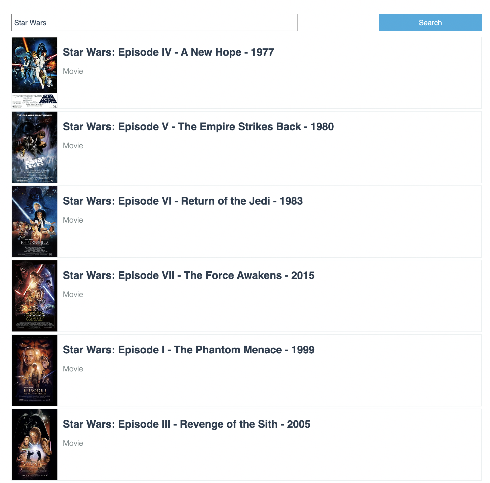

## Movie Catalog App

Build a simple app to fetch and search movies. The app should have:
- a search input where users can type the name of a movie
- a movie list where the results are listed
- a pagination component to switch between different results pages

[Bogdan Nedelcu](mailto:bogdan@codewithdragos.com)

### [Click here to see the Video Review]([LINK_TO_LOOM_VIDEO])

## Proposed Solution

- a simple UI with fake data was built first
- the pagination logic was added and tested
- the API was integrated and the results are stored in component state

### [Click here to see the Live Demo](https://elegant-ride-26d54a.netlify.app/#/)

## Screenshots

## Assumptions

- no authentication is needed at the moments
- no need for a global state management solution 

## Libraries / Tools Used

- React.js
- Create React App for project setup
- Styled-Components
- Jest for testing

## Setup

To install the dependencies run:

`npm install`

And to run the app:

`npm start`

## Running the tests

You can run the unit tests using:

`npm test`

## Future Work

1. Complete test coverage to achieve 90%
2. Improve styling and responsive design
3. Test for performance and consider setting up a CDN
4. Adding a global state management solution
5. Would be great to add `end2end` tests with `Cypress`

